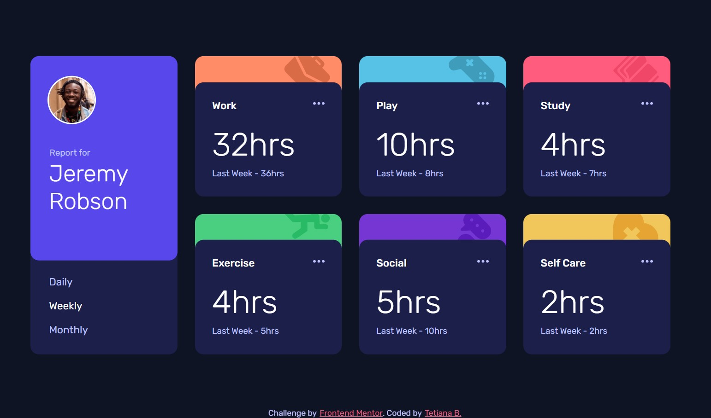

# Frontend Mentor - Time tracking dashboard solution

This is a solution to the [Time tracking dashboard challenge on Frontend Mentor](https://www.frontendmentor.io/challenges/time-tracking-dashboard-UIQ7167Jw). Frontend Mentor challenges help you improve your coding skills by building realistic projects. 

## Table of contents

- [Overview](#overview)
  - [The challenge](#the-challenge)
  - [Screenshot](#screenshot)
  - [Links](#links)
- [My process](#my-process)
  - [Built with](#built-with)
  - [What I learned](#what-i-learned)
  - [Useful resources](#useful-resources)
- [Author](#author)

## Overview

### The challenge

Users should be able to:

- View the optimal layout for the site depending on their device's screen size
- See hover states for all interactive elements on the page
- Switch between viewing Daily, Weekly, and Monthly stats

### Screenshot

### Links

- Solution URL: [GitHub](https://github.com/Shcracoziabra/time-tracking-dashboard)
- Live Site URL: [Netlify](https://shcraco-time-tracking.netlify.app)

## My process

### Built with

- Semantic HTML5 markup
- CSS custom properties
- CSS Grid
- Vanilla JS

### What I learned

With this challenge I learned to create responsive Grid app.
Here I used data from `data.json` to generate html content.

### Useful resources

- [CSS-tricks Grid](https://css-tricks.com/snippets/css/complete-guide-grid/) - This helped me to understand some CSS Grid concepts.

### Author
- GitHub - [Tetiana B.](https://github.com/Shcracoziabra)
- Frontend Mentor - [@Shcracoziabra](https://www.frontendmentor.io/profile/Shcracoziabra)
